# HTMX FastAPI Service

[](https://github.com/astevko/htmx-fastapi-service/actions/workflows/docker-test.yml)
[](https://hub.docker.com/r/andystevko/htmx-fastapi-service)
[](https://github.com/astevko/htmx-fastapi-service/pkgs/container/htmx-fastapi-service)
[](https://github.com/astevko/htmx-fastapi-service)
[](https://github.com/astevko/htmx-fastapi-service)

A modern, secure web application built with FastAPI and HTMX, demonstrating server-side rendering with enterprise-grade security features.

## 🏗️ Architecture & Security Overview

```mermaid
graph TB
    subgraph "🌐 Client Layer"
        Browser[Browser]
        HTMX[HTMX Client]
        CSP[Content Security Policy]
    end
    
    subgraph "🔒 Security Layer"
        Nginx[Nginx Reverse Proxy]
        RateLimit[Rate Limiting<br/>5 req/min login<br/>10 req/sec API]
        SecurityHeaders[Security Headers<br/>HSTS, XSS, CSRF]
        WAF[Web Application Firewall]
    end
    
    subgraph "🚀 Application Layer"
        FastAPI[FastAPI Application]
        Auth[JWT Authentication<br/>Access + Refresh Tokens]
        Middleware[Security Middleware<br/>CORS, TrustedHost]
        Validation[Input Validation<br/>Pydantic Models]
    end
    
    subgraph "🔐 Authentication & Authorization"
        Login[Login Endpoint<br/>Rate Limited]
        Bcrypt[bcrypt Password Hashing<br/>Salt + Rounds]
        JWT[JWT Token Management<br/>Separate Secrets]
        Refresh[Token Refresh<br/>7-day Expiration]
    end
    
    subgraph "💾 Data Layer"
        PostgreSQL[(PostgreSQL Database)]
        SQLAlchemy[SQLAlchemy ORM<br/>Parameterized Queries]
        Sessions[Database Sessions<br/>Connection Pooling]
    end
    
    subgraph "📊 Monitoring & Logging"
        SecurityLogs[Security Event Logging<br/>Failed Logins<br/>Token Issues]
        AppLogs[Application Logging<br/>INFO Level]
        AuditTrail[Audit Trail<br/>User Actions]
    end
    
    subgraph "🐳 Container Layer"
        Docker[Docker Containers]
        HealthCheck[Health Checks]
        ResourceLimits[Resource Limits<br/>Memory: 512MB<br/>CPU: 1 Core]
    end
    
    Browser --> HTMX
    HTMX --> CSP
    CSP --> Nginx
    Nginx --> RateLimit
    RateLimit --> SecurityHeaders
    SecurityHeaders --> WAF
    WAF --> FastAPI
    FastAPI --> Middleware
    Middleware --> Validation
    Validation --> Auth
    Auth --> Login
    Login --> Bcrypt
    Bcrypt --> JWT
    JWT --> Refresh
    Refresh --> SQLAlchemy
    SQLAlchemy --> PostgreSQL
    PostgreSQL --> Sessions
    Sessions --> SecurityLogs
    SecurityLogs --> AppLogs
    AppLogs --> AuditTrail
    AuditTrail --> Docker
    Docker --> HealthCheck
    HealthCheck --> ResourceLimits
```



## 🔐 Security Features Deep Dive

```mermaid
graph LR
    subgraph "🛡️ Authentication Security"
        A1[bcrypt Hashing<br/>Salt + Rounds]
        A2[JWT Tokens<br/>Access + Refresh]
        A3[Rate Limiting<br/>5/min login]
        A4[Secure Cookies<br/>HttpOnly + SameSite]
    end
    
    subgraph "🔒 Network Security"
        B1[HTTPS Enforcement<br/>HSTS Headers]
        B2[CSP Policy<br/>XSS Prevention]
        B3[CORS Protection<br/>Origin Validation]
        B4[Security Headers<br/>X-Frame-Options]
    end
    
    subgraph "🚨 Input Security"
        C1[Pydantic Validation<br/>Type Safety]
        C2[SQL Injection Prevention<br/>Parameterized Queries]
        C3[XSS Protection<br/>Input Sanitization]
        C4[File Upload Security<br/>Type Restrictions]
    end
    
    subgraph "📊 Monitoring Security"
        D1[Security Logging<br/>Failed Attempts]
        D2[Audit Trail<br/>User Actions]
        D3[Error Handling<br/>No Info Disclosure]
        D4[Health Monitoring<br/>Container Status]
    end
    
    subgraph "🔧 Infrastructure Security"
        E1[Dependency Pinning<br/>Version Constraints]
        E2[Container Security<br/>Non-root User]
        E3[Resource Limits<br/>Memory + CPU]
        E4[Secrets Management<br/>Environment Variables]
    end
    
    A1 --> A2
    A2 --> A3
    A3 --> A4
    A4 --> B1
    B1 --> B2
    B2 --> B3
    B3 --> B4
    B4 --> C1
    C1 --> C2
    C2 --> C3
    C3 --> C4
    C4 --> D1
    D1 --> D2
    D2 --> D3
    D3 --> D4
    D4 --> E1
    E1 --> E2
    E2 --> E3
    E3 --> E4
```



### **🛡️ Authentication & Authorization**
- **bcrypt Password Hashing**: Industry-standard password security with salt
- **JWT Token Management**: Dual-token system (access + refresh)
- **Rate Limiting**: 5 login attempts/minute, 10 API requests/second
- **Session Management**: Secure HttpOnly cookies with strict SameSite
- **Token Rotation**: Automatic refresh token mechanism

### **🔐 Security Headers & Policies**
- **Content Security Policy (CSP)**: Prevents XSS attacks
- **Strict Transport Security (HSTS)**: Forces HTTPS connections
- **X-Frame-Options**: Prevents clickjacking attacks
- **X-Content-Type-Options**: Prevents MIME type sniffing
- **Referrer Policy**: Controls referrer information leakage
- **Permissions Policy**: Restricts browser features

### **🚨 Input Validation & Injection Prevention**
- **Pydantic Models**: Strong typing and validation
- **SQLAlchemy ORM**: Parameterized queries prevent SQL injection
- **Input Sanitization**: XSS prevention in user inputs
- **File Upload Security**: Restricted file types and sizes

### **📊 Security Monitoring**
- **Security Event Logging**: Failed login attempts, token issues
- **Audit Trail**: User actions and system events
- **Error Handling**: Secure error messages without information disclosure
- **Health Monitoring**: Container and application health checks

### **🔧 Infrastructure Security**
- **Dependency Pinning**: Exact version constraints prevent supply chain attacks
- **Container Security**: Non-root user, resource limits
- **Network Security**: Internal container communication
- **Secrets Management**: Environment variable-based configuration

## Features

### **🚀 Core Technologies**
- **FastAPI**: Modern, fast web framework for building APIs
- **HTMX**: Dynamic HTML interactions without writing JavaScript
- **Jinja2 Templates**: Server-side templating engine
- **Tailwind CSS**: Utility-first CSS framework for styling
- **uv**: Fast Python package manager and project manager

### **🔒 Security Features**
- **OWASP Top 10 Compliant**: Addresses all major web security risks
- **Enterprise Authentication**: JWT with refresh tokens and bcrypt hashing
- **Rate Limiting**: Protection against brute force and DDoS attacks
- **Security Headers**: Comprehensive HTTP security headers
- **Input Validation**: Pydantic models with strict validation
- **SQL Injection Prevention**: SQLAlchemy ORM with parameterized queries
- **XSS Protection**: Content Security Policy and input sanitization
- **CSRF Protection**: Secure cookies with SameSite attributes
- **Audit Logging**: Security event monitoring and logging

## 🛡️ Security Compliance

### **OWASP Top 10 (2021) Compliance**

| OWASP Risk | Status | Implementation |
|------------|--------|----------------|
| **A01: Broken Access Control** | ✅ **RESOLVED** | bcrypt password hashing, JWT token management |
| **A02: Cryptographic Failures** | ✅ **RESOLVED** | Strong JWT secrets, HTTPS enforcement, secure cookies |
| **A03: Injection** | ✅ **RESOLVED** | SQLAlchemy ORM, Pydantic validation, parameterized queries |
| **A04: Insecure Design** | ✅ **RESOLVED** | Security headers, CSP, input validation |
| **A05: Security Misconfiguration** | ✅ **RESOLVED** | Secure defaults, dependency pinning, container security |
| **A06: Vulnerable Components** | ✅ **RESOLVED** | Pinned dependencies, security scanning |
| **A07: Authentication Failures** | ✅ **RESOLVED** | Rate limiting, secure sessions, token rotation |
| **A08: Software Integrity Failures** | ✅ **RESOLVED** | Dependency pinning, integrity checks |
| **A09: Logging Failures** | ✅ **RESOLVED** | Security event logging, audit trails |
| **A10: SSRF** | ✅ **RESOLVED** | Input validation, URL filtering |

### **Security Score: 9/10** 🟢

**Security Level**: **PRODUCTION READY** ✅

### **Security Testing**

```bash
# Run security tests
uv run pytest test_security.py

# Check for dependency vulnerabilities
uv audit

# Validate security headers
curl -I http://localhost:8000
```

## 🚀 Production Deployment Security Checklist

### **Pre-Deployment Security Verification**

- [ ] **Environment Variables Set**
  - [ ] `SECRET_KEY` - Strong random key (32+ characters)
  - [ ] `JWT_REFRESH_SECRET` - Different from SECRET_KEY
  - [ ] `DEMO_USERNAME` - Changed from default
  - [ ] `DEMO_PASSWORD` - Strong password (8+ characters)

- [ ] **HTTPS Configuration**
  - [ ] SSL certificates installed
  - [ ] HSTS headers enabled
  - [ ] HTTP redirects to HTTPS

- [ ] **Security Headers Validation**
  ```bash
  curl -I https://yourdomain.com
  # Verify: X-Frame-Options, CSP, HSTS, etc.
  ```

- [ ] **Rate Limiting Test**
  ```bash
  # Test login rate limiting
  for i in {1..10}; do curl -X POST https://yourdomain.com/api/login; done
  ```

- [ ] **Dependency Security**
  ```bash
  uv audit  # Check for vulnerabilities
  ```

### **Post-Deployment Monitoring**

- [ ] **Security Logs Monitoring**
  - [ ] Failed login attempts
  - [ ] Token validation errors
  - [ ] Rate limit violations

- [ ] **Health Checks**
  - [ ] Container health status
  - [ ] Database connectivity
  - [ ] Application responsiveness

- [ ] **Performance Monitoring**
  - [ ] Response times
  - [ ] Resource usage
  - [ ] Error rates

## Project Structure

```
htmx-fastapi-service/
├── main.py                 # FastAPI application
├── pyproject.toml          # Project configuration and dependencies
├── templates/              # Jinja2 HTML templates
│   ├── index.html         # Main page template
│   ├── message_partial.html # Message partial template
│   └── messages_list.html  # Messages list template
├── static/                 # Static files (CSS, JS, images)
│   ├── css/
│   └── js/
└── README.md              # This file
```

## Getting Started

### Prerequisites

- Python 3.13+
- [uv](https://docs.astral.sh/uv/) package manager

### Security Configuration

**⚠️ IMPORTANT**: Set strong environment variables before running in production:

```bash
# Copy environment template
cp env.example .env

# Generate strong secrets (required for production)
export SECRET_KEY="$(openssl rand -base64 32)"
export JWT_REFRESH_SECRET="$(openssl rand -base64 32)"

# Set secure credentials
export DEMO_USERNAME="your-secure-username"
export DEMO_PASSWORD="your-secure-password"
```

### Installation

1. Clone or navigate to the project directory:
   ```bash
   cd htmx-fastapi-service
   ```

2. Install dependencies:
   ```bash
   uv sync
   ```

3. Run the development server:
   ```bash
   uv run python main.py
   ```

   Or alternatively:
   ```bash
   uv run uvicorn main:app --reload
   ```

4. Open your browser and visit: http://localhost:8000

## Development

### Adding Dependencies

To add new dependencies:
```bash
uv add package-name
```

To add development dependencies:
```bash
uv add --dev package-name
```

### Running Tests

```bash
uv run pytest
```

### Code Formatting

```bash
uv run black .
uv run isort .
```

## API Endpoints

- `GET /` - Home page with HTMX demo
- `POST /api/message` - Create a new message (HTMX endpoint)
- `GET /api/messages` - Get all messages (HTMX endpoint)

## HTMX Features Demonstrated

- **Form Submission**: Adding messages without page refresh
- **Dynamic Content Loading**: Refreshing messages list
- **Partial Updates**: Updating specific parts of the page
- **Server-Side Rendering**: Templates rendered on the server

## Technologies Used

- [FastAPI](https://fastapi.tiangolo.com/) - Web framework
- [HTMX](https://htmx.org/) - Dynamic HTML
- [Jinja2](https://jinja.palletsprojects.com/) - Template engine
- [Tailwind CSS](https://tailwindcss.com/) - CSS framework
- [uv](https://docs.astral.sh/uv/) - Python package manager
- [Uvicorn](https://www.uvicorn.org/) - ASGI server

## Docker Deployment

### Development Mode

Run the application in development mode with hot reloading:

```bash
# Using Docker Compose
docker-compose up --build

# Or using the convenience script
./scripts/docker-dev.sh
```

The application will be available at:
- **Application**: http://localhost:8000
- **API Documentation**: http://localhost:8000/docs

### Production Mode

Deploy the application in production mode with Nginx reverse proxy:

```bash
# Using Docker Compose
docker-compose -f docker-compose.prod.yml up --build -d

# Or using the convenience script
./scripts/docker-prod.sh
```

The application will be available at:
- **Application**: http://localhost (port 80)
- **API Documentation**: http://localhost/docs

### Docker Commands

```bash
# Validate Docker setup
./scripts/validate-docker.sh

# Build the image
docker build -t htmx-fastapi-service .

# Run the container
docker run -p 8000:8000 htmx-fastapi-service

# View logs
docker-compose logs -f

# Stop services
docker-compose down

# Rebuild and restart
docker-compose up --build --force-recreate
```

### Production Features

- **Nginx Reverse Proxy**: Handles static files and load balancing
- **Health Checks**: Automatic container health monitoring
- **Security Headers**: XSS protection, content type options, etc.
- **Rate Limiting**: API rate limiting to prevent abuse
- **Gzip Compression**: Automatic compression for better performance
- **Resource Limits**: Memory and CPU limits for containers
- **Security Monitoring**: Failed login attempts, token validation
- **Audit Logging**: User actions and security events
- **Dependency Security**: Pinned versions prevent supply chain attacks

## DuckDB Database Management

This application uses DuckDB as its embedded database for message storage. A web-based management interface (Duck-UI) is available for database administration.

### Starting Duck-UI

**Option 1: Using the convenience script**
```bash
./scripts/start-duck-ui.sh
```

**Option 2: Using Docker Compose directly**
```bash
# Development mode
docker-compose --profile dev up -d duck-ui

# Production mode (includes Duck-UI)
docker-compose -f docker-compose.prod.yml up -d
```

### Accessing Duck-UI

Once started, Duck-UI will be available at: **http://localhost:5522**

### Duck-UI Features

- **Database Browser**: View all tables, schemas, and data
- **SQL Query Interface**: Execute SQL queries directly
- **Data Visualization**: Explore your message data
- **Database Management**: Create, modify, and delete tables

### Database Schema

The application creates the following schema:

```sql
CREATE SEQUENCE id_sequence START 1;
CREATE TABLE messages (
    id INTEGER DEFAULT nextval('id_sequence'),
    text VARCHAR NOT NULL,
    timestamp TIMESTAMP NOT NULL
);
```

### Useful SQL Queries

```sql
-- View all messages
SELECT * FROM messages ORDER BY timestamp DESC;

-- Count total messages
SELECT COUNT(*) FROM messages;

-- Messages from last 24 hours
SELECT * FROM messages 
WHERE timestamp >= now() - INTERVAL '1 day'
ORDER BY timestamp DESC;

-- Most active time periods
SELECT 
    DATE_TRUNC('hour', timestamp) as hour,
    COUNT(*) as message_count
FROM messages 
GROUP BY hour 
ORDER BY hour DESC;
```

### Data Persistence

- **Development**: Database files are stored in Docker volumes
- **Production**: Persistent storage with `duckdb_data` volume
- **Backup**: Database files are automatically backed up with container volumes

## Database Management Scripts

The project includes comprehensive scripts for database backup, restore, and export operations.

### Quick Start

**Interactive Database Management:**
```bash
./scripts/db-manage.sh
```

### Available Scripts

#### **1. Database Management (Interactive)**
```bash
./scripts/db-manage.sh
```
- Interactive menu for all database operations
- Backup, restore, export, statistics, and maintenance
- User-friendly interface with colored output

#### **2. Database Backup**
```bash
# Basic backup
./scripts/backup-duckdb.sh

# Compressed backup
./scripts/backup-duckdb.sh -c

# Custom options
./scripts/backup-duckdb.sh -d /path/to/db.duckdb -o /backups -c -k 5
```

**Backup Options:**
- `-d, --database`: Database file path
- `-o, --output`: Backup directory
- `-c, --compress`: Compress backup files
- `-r, --remote`: Upload to remote server
- `-k, --keep`: Keep N recent backups

#### **3. Database Restore**
```bash
# Interactive restore (list available backups)
./scripts/restore-duckdb.sh

# Restore specific backup
./scripts/restore-duckdb.sh messages_backup_20241201_143022.duckdb

# Force restore without confirmation
./scripts/restore-duckdb.sh -f backup.duckdb
```

**Restore Options:**
- `-l, --list`: List available backups
- `-d, --database`: Target database path
- `-f, --force`: Force restore without confirmation

#### **4. Data Export**
```bash
# Export all tables to CSV
./scripts/export-duckdb.sh

# Export to JSON
./scripts/export-duckdb.sh -f json

# Export specific table
./scripts/export-duckdb.sh -t messages -f json

# Export with custom query
./scripts/export-duckdb.sh -q "SELECT * FROM messages WHERE text LIKE '%test%'" -f csv
```

**Export Formats:**
- `csv`: Comma-separated values
- `json`: JSON format
- `sql`: SQL INSERT statements
- `parquet`: Apache Parquet format

### Backup Strategy

#### **Automated Backups**
```bash
# Add to crontab for daily backups
0 2 * * * /path/to/project/scripts/backup-duckdb.sh -c -k 30
```

#### **Backup Retention**
- **Development**: Keep 10 recent backups
- **Production**: Keep 30+ backups with compression
- **Remote Storage**: Upload to cloud storage for long-term retention

### Data Export Examples

#### **Export All Data**
```bash
# Export everything to CSV
./scripts/export-duckdb.sh -f csv

# Export to Parquet for analytics
./scripts/export-duckdb.sh -f parquet
```

#### **Custom Queries**
```bash
# Recent messages
./scripts/export-duckdb.sh -q "SELECT * FROM messages WHERE timestamp >= now() - INTERVAL '7 days'" -f json

# Message statistics
./scripts/export-duckdb.sh -q "SELECT DATE_TRUNC('day', timestamp) as day, COUNT(*) as count FROM messages GROUP BY day" -f csv

# Search messages
./scripts/export-duckdb.sh -q "SELECT * FROM messages WHERE text LIKE '%error%'" -f sql
```

### Database Maintenance

#### **Regular Maintenance**
```bash
# Run database maintenance
./scripts/db-manage.sh
# Select option 7: Database maintenance
```

#### **Statistics and Monitoring**
```bash
# View database statistics
./scripts/db-manage.sh
# Select option 5: Database statistics
```

### Disaster Recovery

#### **Full Restore Process**
1. **Stop Application**: Ensure no writes to database
2. **Create Emergency Backup**: `./scripts/backup-duckdb.sh -c`
3. **Restore Database**: `./scripts/restore-duckdb.sh`
4. **Verify Data**: Check statistics and test queries
5. **Restart Application**: Resume normal operations

#### **Data Validation**
```bash
# Export and verify data integrity
./scripts/export-duckdb.sh -f csv
./scripts/export-duckdb.sh -q "SELECT COUNT(*) FROM messages"
```

## GitHub Actions CI/CD

This project includes automated CI/CD workflows for building and publishing Docker images:

### Available Workflows

- **`docker-test.yml`**: Builds and tests Docker image on every push/PR
- **`docker-build.yml`**: Publishes to Docker Hub on main branch and tags
- **`docker-publish-ghcr.yml`**: Publishes to GitHub Container Registry

### Setup for Docker Hub Publishing

**Note**: Your GitHub username and Docker Hub username can be different. This project uses `andystevko` as the Docker Hub username.

1. Create a Docker Hub account at [hub.docker.com](https://hub.docker.com)
2. Create an access token in Docker Hub settings
3. Add these secrets to your GitHub repository:
   - `DOCKER_USERNAME`: `andystevko` (your Docker Hub username)
   - `DOCKER_TOKEN`: Your Docker Hub access token

### Automatic Features

- **Multi-platform builds**: AMD64 and ARM64 support
- **Security scanning**: Trivy vulnerability scanning
- **Automatic tagging**: Based on branches and git tags
- **Cache optimization**: Faster builds with GitHub Actions cache

### Pulling Images

```bash
# Docker Hub (uses Docker Hub username: andystevko)
docker pull andystevko/htmx-fastapi-service:latest

# GitHub Container Registry (uses GitHub username: astevko)
docker pull ghcr.io/astevko/htmx-fastapi-service:latest
```

For detailed setup instructions, see [.github/README.md](.github/README.md).

## Kubernetes Deployment

Deploy to Kubernetes (Docker Desktop) with the included manifests:

### Quick Start

```bash
# Deploy with NodePort (accessible on localhost:30080)
cd k8s
./deploy.sh
# Choose option 2

# Access the application
open http://localhost:30080
```

### Manual Deployment

```bash
# Create namespace and deploy
kubectl apply -f k8s/namespace.yaml
kubectl apply -f k8s/configmap.yaml
kubectl apply -f k8s/deployment.yaml
kubectl apply -f k8s/service-nodeport.yaml

# Access at http://localhost:30080
```

### Features

- **2 replicas** for high availability
- **Health checks** with liveness and readiness probes
- **Resource limits** and security context
- **Multiple access methods**: NodePort, ClusterIP, Ingress
- **Easy cleanup** with provided scripts

For detailed Kubernetes deployment instructions, see [k8s/README.md](k8s/README.md).

## License

This project is open source and available under the [MIT License](LICENSE).
